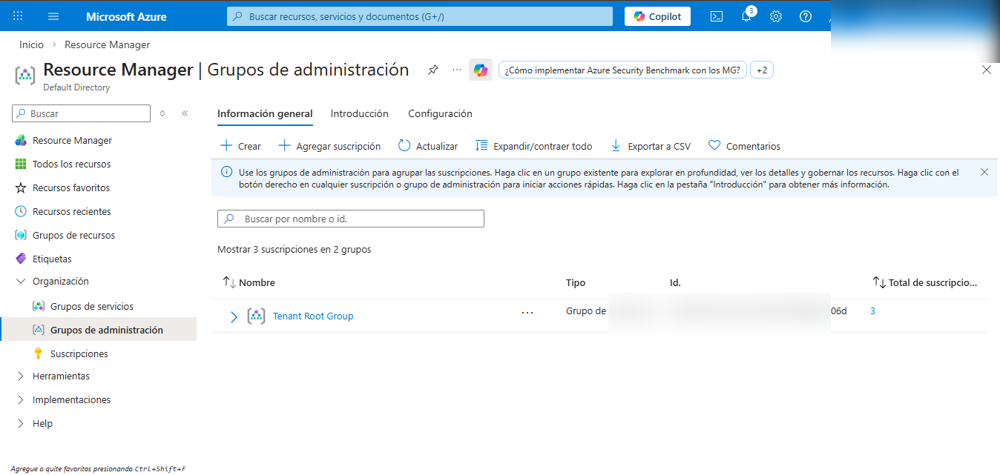
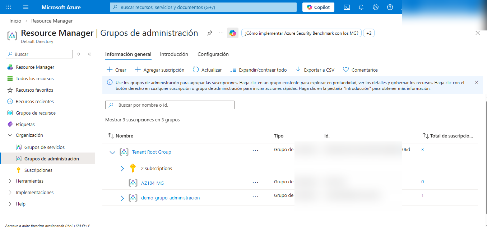
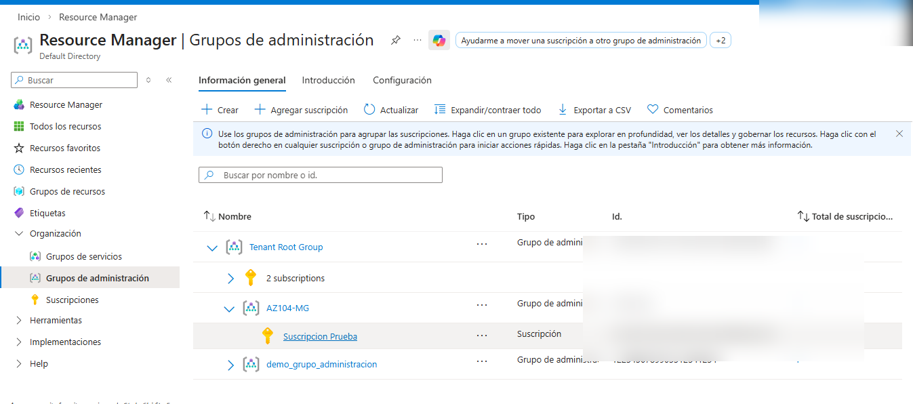

# Lab 02a — Manage Subscriptions and RBAC (AZ-104)

## Objetivo
Configurar **Management Groups** y administrar acceso con **RBAC**, incluyendo la creación y asignación de un **rol personalizado**.

## Evidencias (paso a paso)

### 1) Habilitar “Administración del acceso para los recursos de Azure” (Entra ID)
Se validó/activó la opción en **Entra ID → Propiedades**.

---

### 2) Visualizar Management Groups (estado inicial)
Se revisó la jerarquía inicial en **Resource Manager → Grupos de administración** (Tenant Root Group).

---

### 3) Crear el Management Group **AZ104-MG**
Se creó el management group **AZ104-MG**.

---

### 4) Mover la suscripción al Management Group **AZ104-MG**
Se movió la suscripción para que quedara bajo **AZ104-MG**.

---

### 5) Asignar rol integrado “Colaborador de la máquina virtual” al grupo **helpdesk**
En **AZ104-MG → Control de acceso (IAM)** se asignó el rol **Colaborador de la máquina virtual** al grupo **helpdesk**.

---

### 6) Crear rol personalizado “Help Desk Operator”
Se creó el rol personalizado y se definieron permisos en la pestaña **Permisos**.

---

### 7) Asignar rol personalizado “Help Desk Operator” al grupo **helpdesk**
Se asignó el rol **Help Desk Operator** al grupo **helpdesk** a nivel del management group **AZ104-MG**.

---

## Notas
Se aplicó ocultamiento/difuminado de datos sensibles (IDs, correos, tenant/subscription IDs).
