# Lab 02b - Manage Governance via Azure Policy

## Overview
In this lab, I implemented governance controls using **Azure Policy**, **resource tags**, and **resource locks** to enforce standards and protect resources.

## Objectives
- Apply tags to a resource group.
- Enforce tags using an Azure Policy assignment.
- Remediate non-compliant resources using a Modify policy.
- Configure and validate resource locks.

---

## Task 1: Create a resource group and assign tags
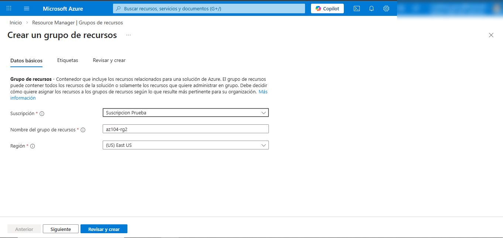

---

## Task 2: Enforce tagging with Azure Policy (Deny)
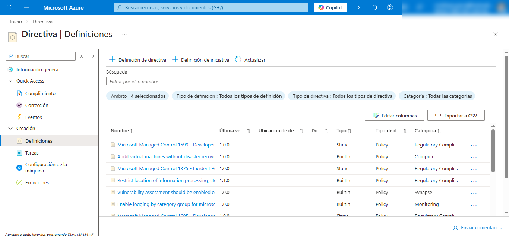

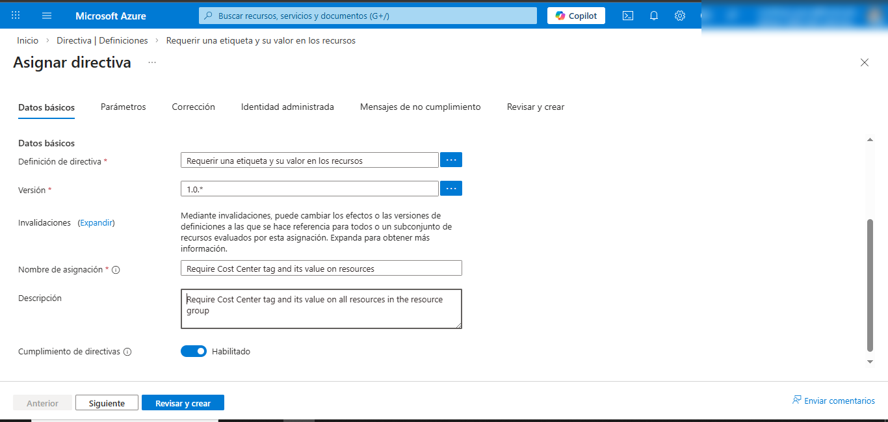
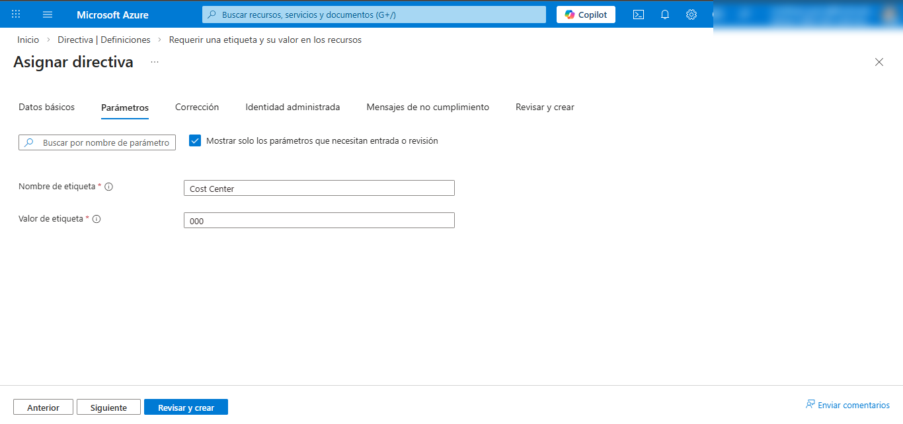

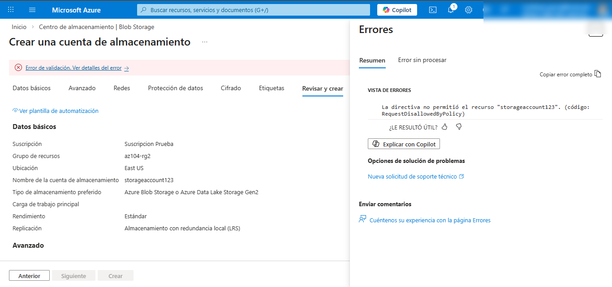

---

## Task 3: Remediate tagging with Azure Policy (Modify / Inherit Tag)
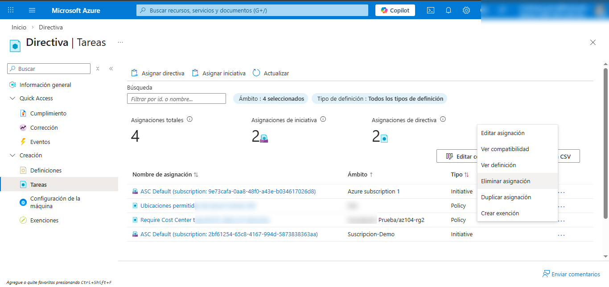
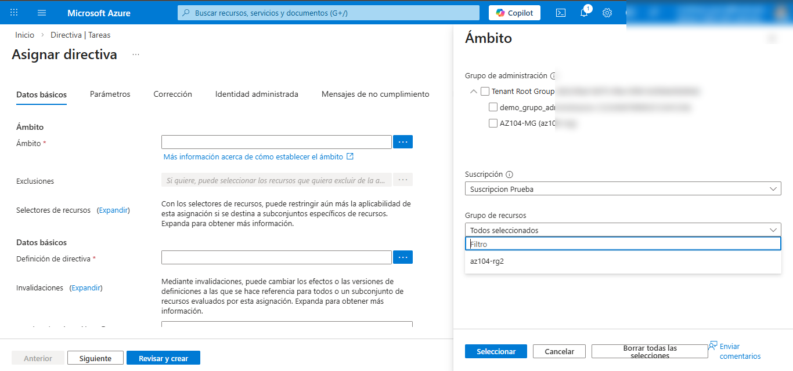

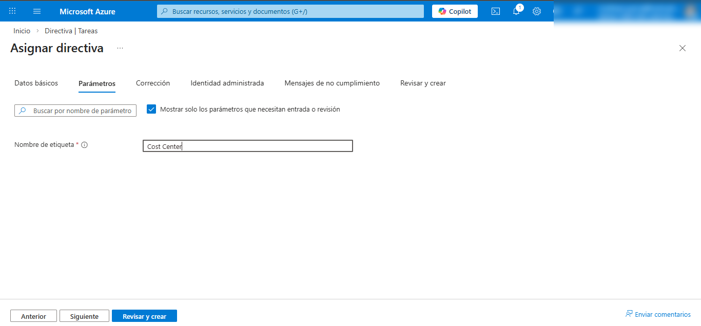

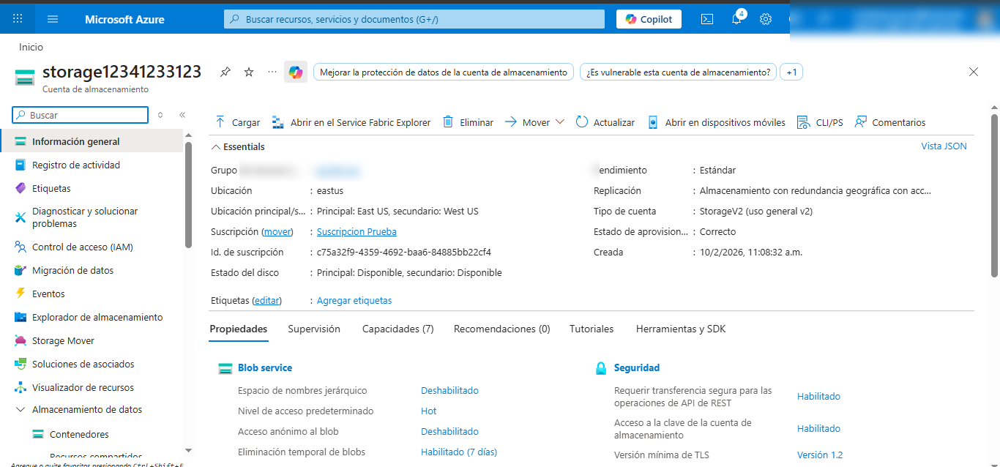

---

## Task 4: Configure and test resource locks

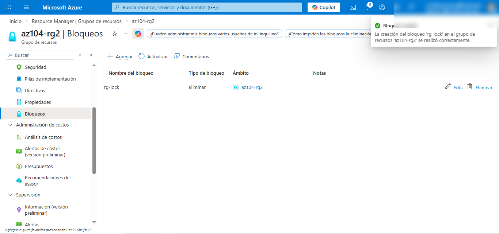
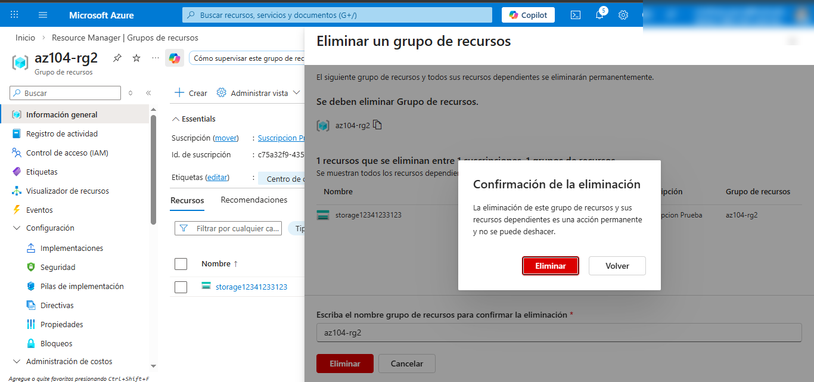
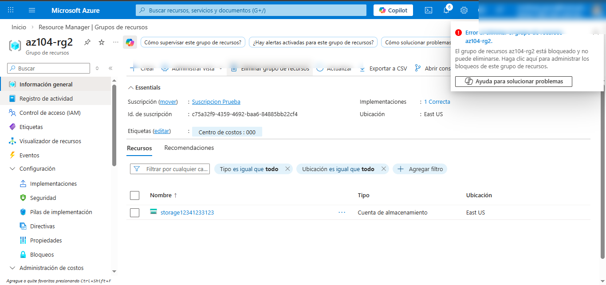

---

## Key takeaways
- **Tags** help organize resources and improve reporting.
- **Azure Policy** enforces standards (Deny) and can remediate resources (Modify).
- **Remediation tasks** help bring existing resources into compliance.
- **Resource locks** prevent accidental deletion/modification.

## Cleanup

- [cleanup.md](./cleanup.md)
