# Lab 03 - Manage Azure Resources using ARM Templates (PowerShell, Azure CLI y Bicep)

## Objetivo
En este laboratorio practiqué despliegues de infraestructura como código (IaC) usando:
- ARM Template + **Cloud Shell (PowerShell)**
- ARM Template + **Cloud Shell (Bash) con Azure CLI**
- **Bicep** + **Azure CLI**

> Resource Group: `az104-rg3`

---

## Task 3 - Cloud Shell (PowerShell) + ARM Template
En esta tarea validé el Resource Group, subí los archivos `template.json` y `parameters.json` a Cloud Shell, corregí el contexto de suscripción y ejecuté el despliegue con PowerShell para crear `az104-disk3`.

**Evidencias:**
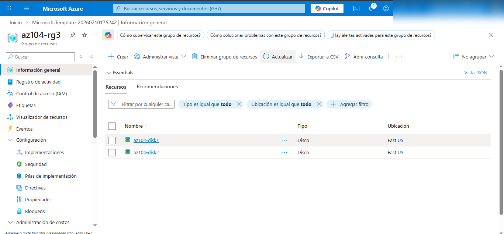
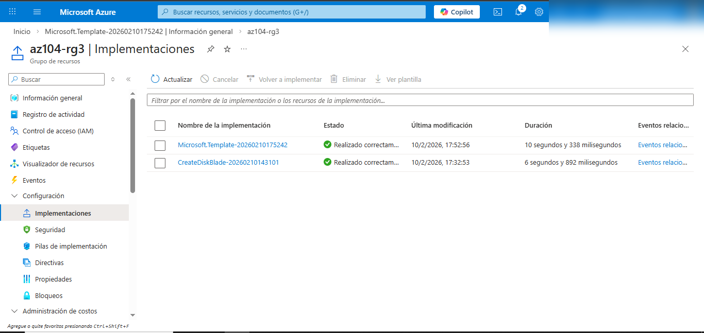
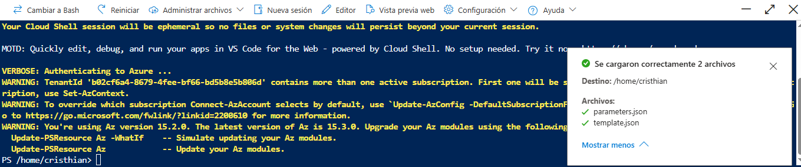
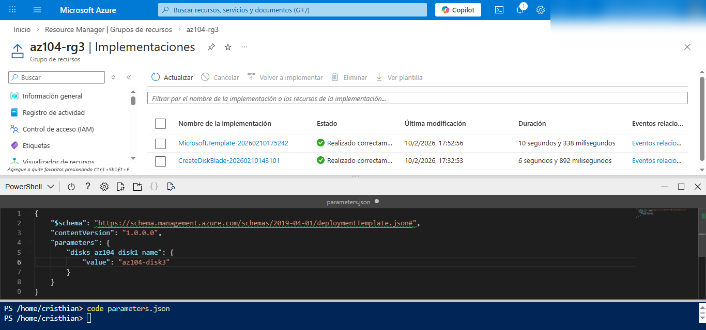
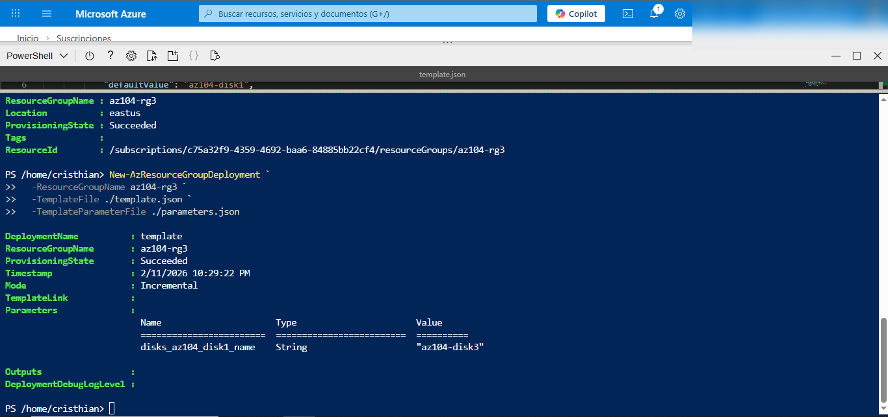
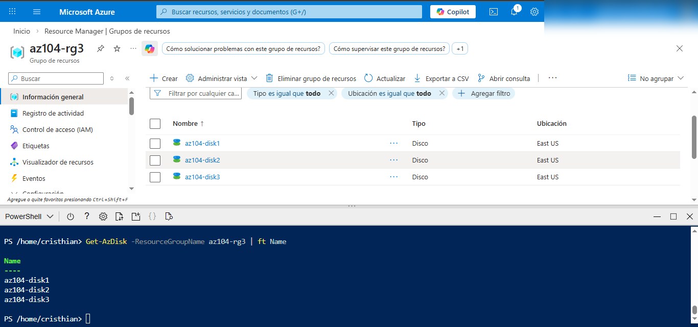

---

## Task 4 - Cloud Shell (Bash) + Azure CLI + ARM Template
En esta tarea edité `parameters.json` para crear `az104-disk4` y desplegué el template usando Azure CLI.

**Evidencias:**
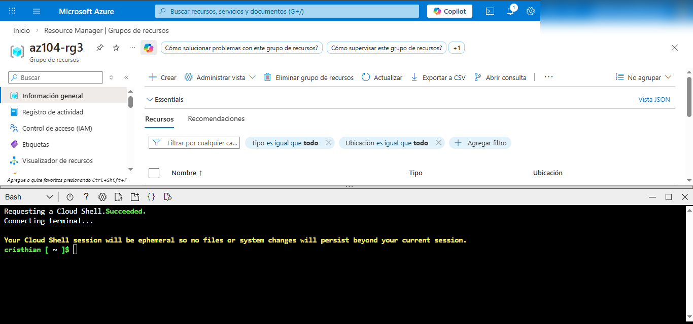
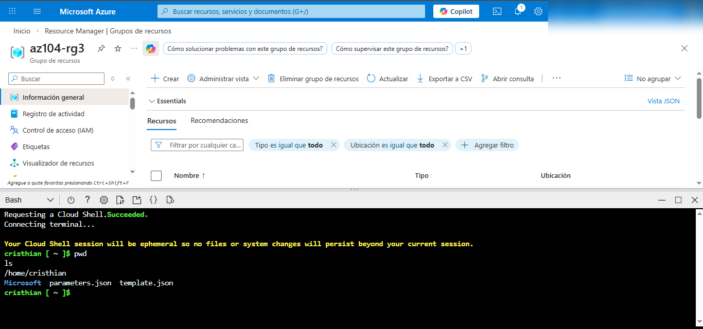
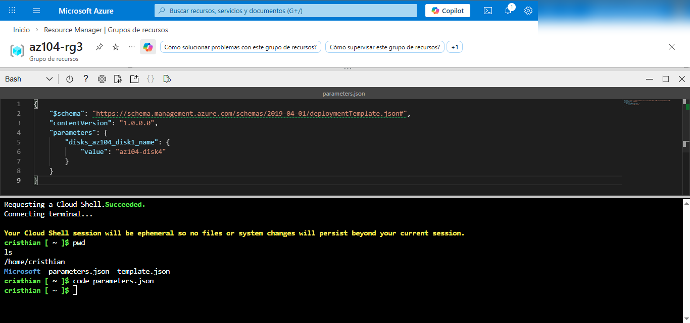
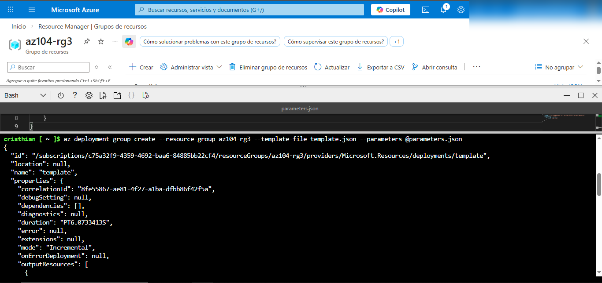
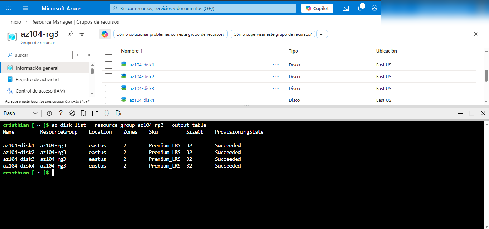

---

## Task 5 - Bicep + Azure CLI (Cloud Shell Bash)
En esta tarea subí `azuredeploydisk.bicep`, modifiqué parámetros para crear `az104-disk5` (32 GiB, StandardSSD_LRS) y desplegué con Azure CLI.

**Evidencias:**

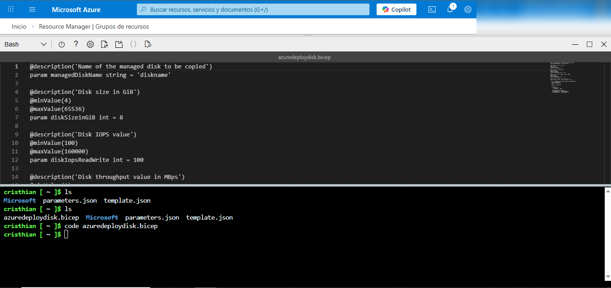
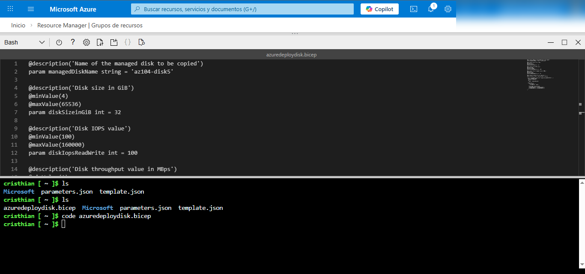
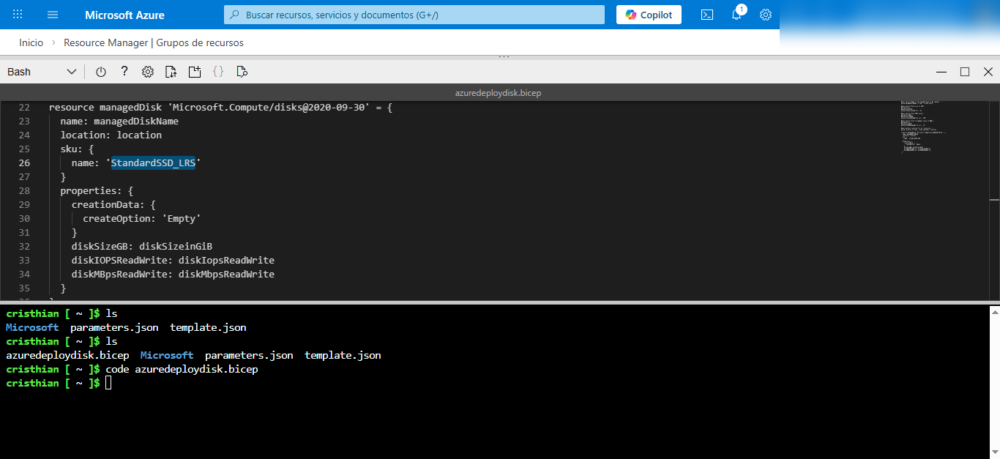
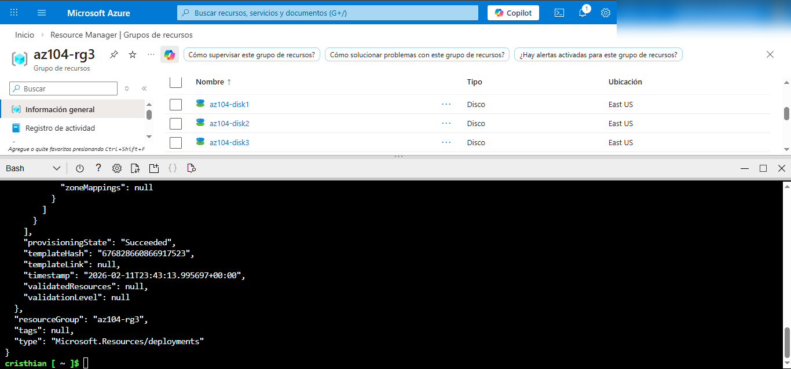
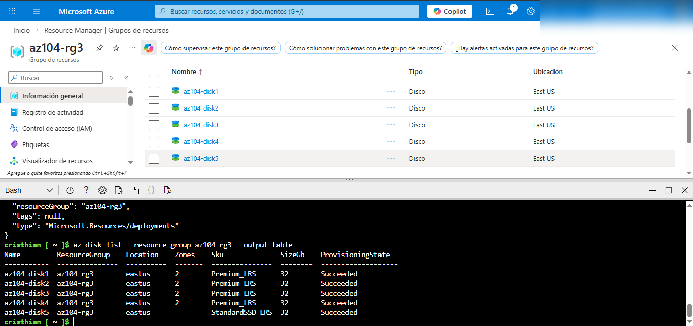

---

## Cleanup (Importante)
Al finalizar el laboratorio, se recomienda eliminar el Resource Group para evitar costos.

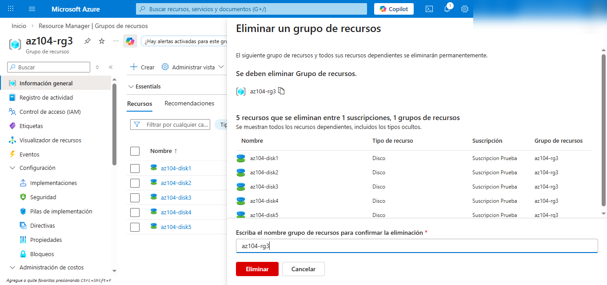
