# Lab 04 - Manage Virtual Networking

Evidencias del laboratorio: creación y configuración de VMs y redes virtuales, reglas NSG, VNet peering, pruebas de conectividad y limpieza del Resource Group.

---

## 1) VM1 (creación) + troubleshooting
**Deployment en progreso**
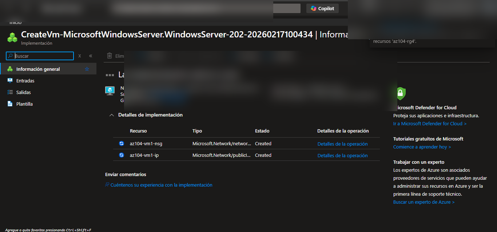

**Error en el deployment**
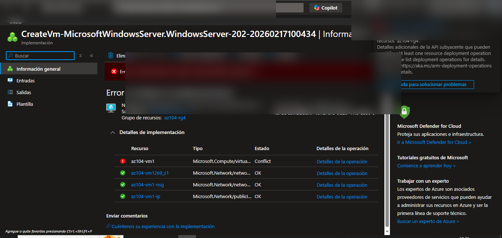

---

## 2) VM1 (eliminación) + limpieza del RG
**Eliminar VM1 (diálogo de borrado)**
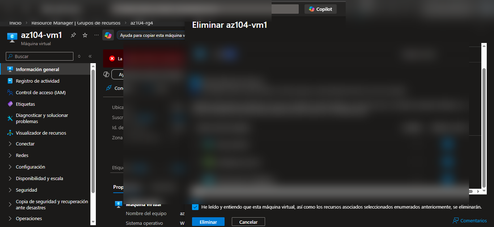

**Error al eliminar (AllocationFailed / recursos asociados)**
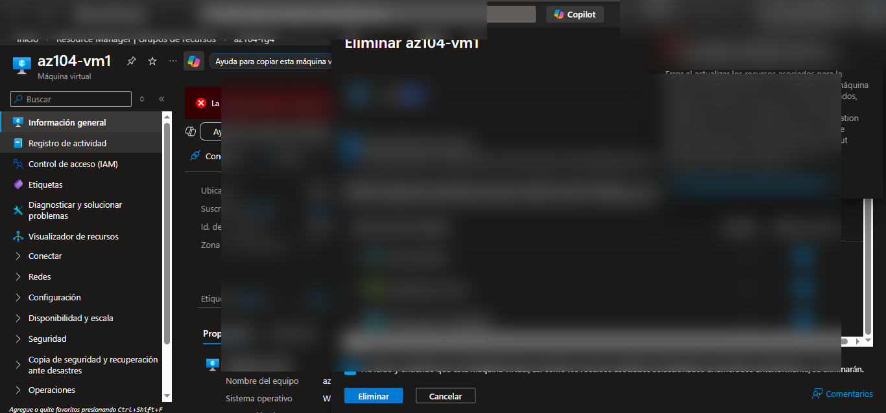

**Recursos en RG antes del cleanup**
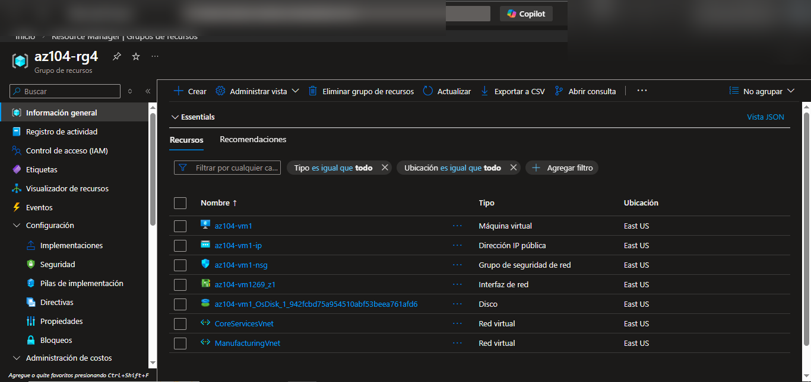

**RG después de borrar VM1 (recursos restantes)**
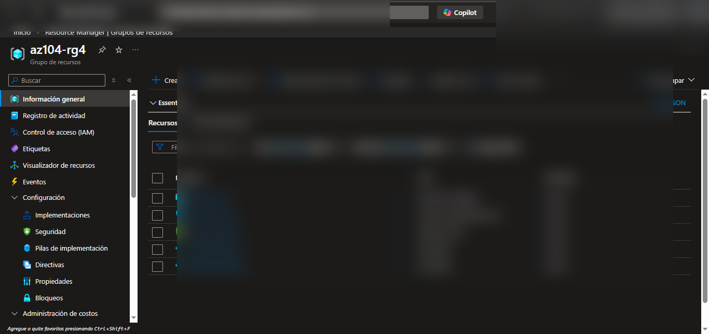

**RG con solo VNets**
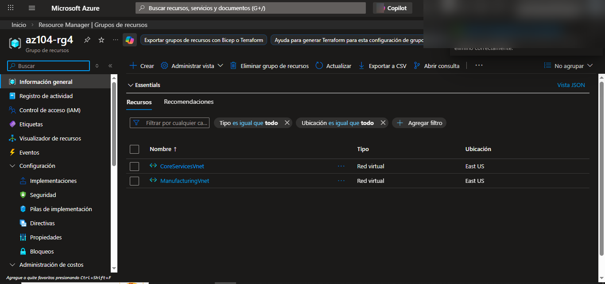

---

## 3) VM1 (Networking) en CoreServicesVnet
**Crear VM1 - Networking (CoreServicesVnet / SharedServicesSubnet)**

**Deployment completado**

**VM1 Overview**
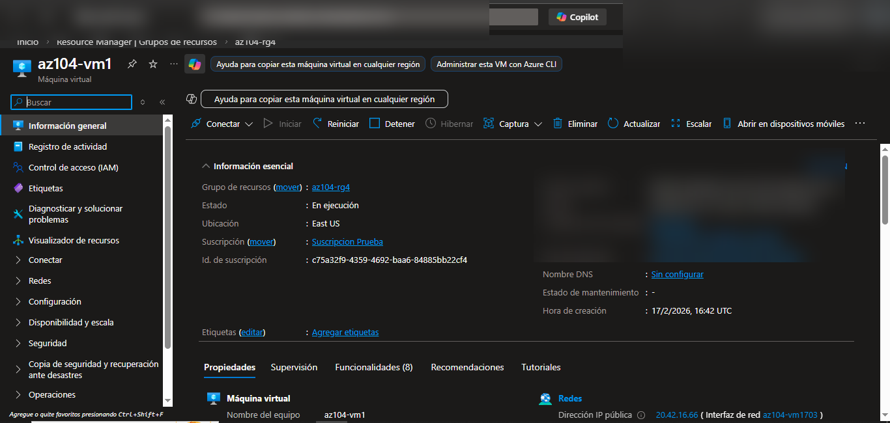

**VM1 - Network configuration**
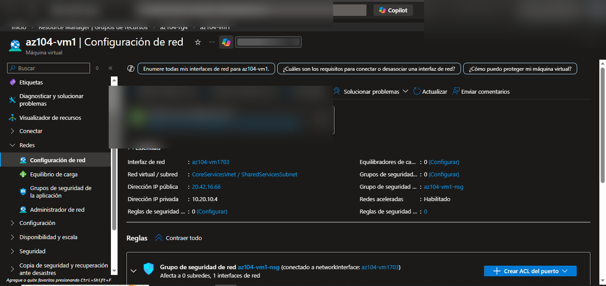

**NSG inbound: RDP 3389 permitido**

**RDP a VM1 (pantalla de primer login)**

---

## 4) VM2 (sin IP pública) en ManufacturingVnet
**Crear VM2 - Networking (ManufacturingVnet / SensorSubnet1, Public IP: None)**

**VM2 Overview**
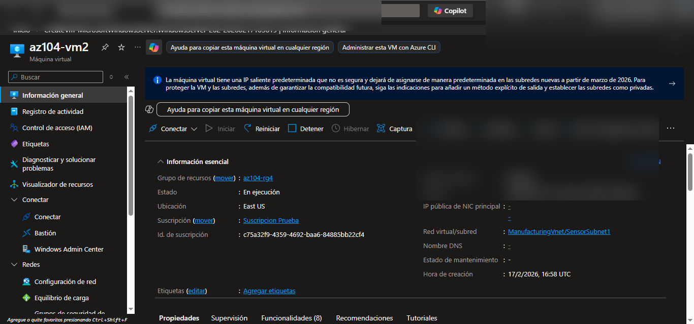

**VM2 - Network configuration**
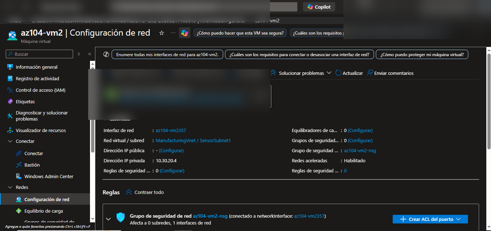

---

## 5) VNet Peering (CoreServicesVnet ↔ ManufacturingVnet)
**Formulario de peering (CoreServicesVnet → ManufacturingVnet)**

**Configuración remota (ManufacturingVnet)**

**Configuración local (CoreServicesVnet)**

**Peerings en CoreServicesVnet (Connected/Synced)**

**Peerings en ManufacturingVnet (Connected/Synced)**

---

## 6) Pruebas de conectividad y acceso (Nested RDP)
**Desde VM1: Test-NetConnection a VM2:3389 (Success)**

**Nested RDP (VM1 → VM2)**

**Dentro de VM2: ipconfig + hostname**

---

## 7) Cleanup final (borrar RG)
**Eliminando az104-rg4 (en progreso)**
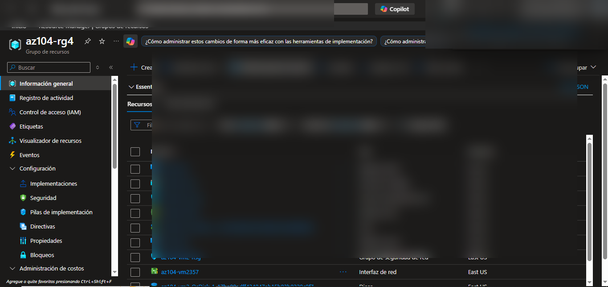

**RG eliminado correctamente**
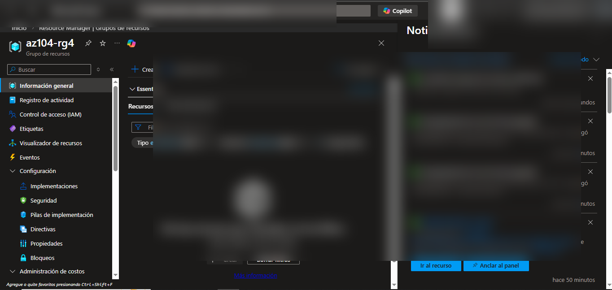
