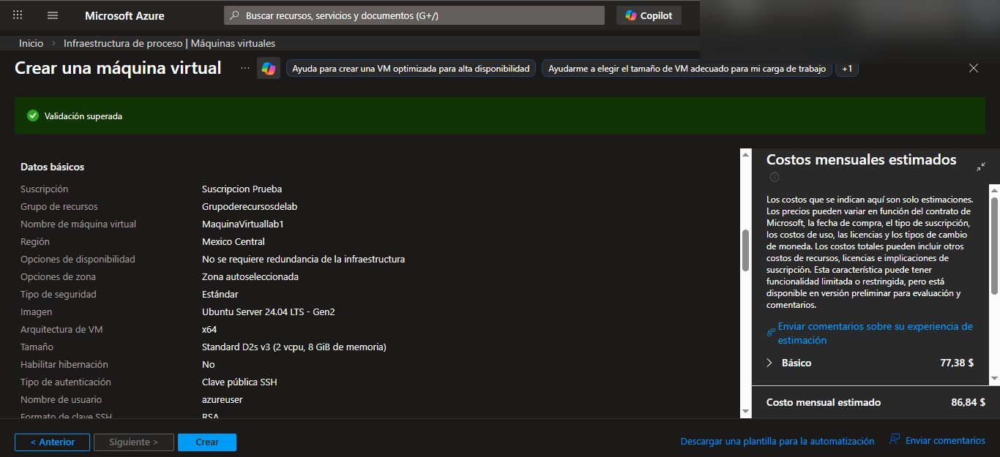
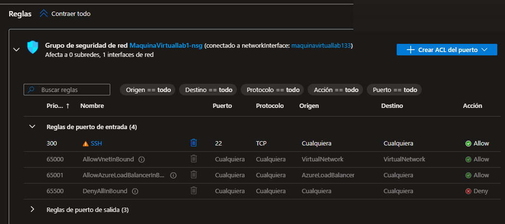
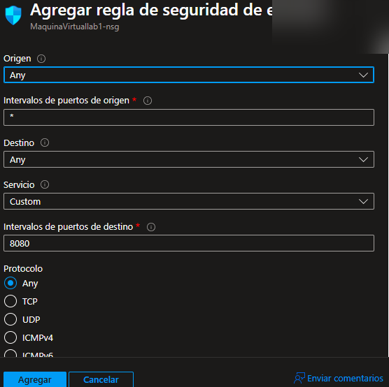

# Extra Lab - Linux VM + Nginx + Azure Monitor + Alertas (AZ-104)

---

## 🎯 Objetivo

Desplegar una máquina virtual Linux en Azure, instalar Nginx, configurar reglas de red, habilitar Azure Monitor, revisar recomendaciones con Azure Advisor y crear alertas basadas en métricas.

Este laboratorio demuestra:

- Administración de Azure Virtual Machines
- Configuración de NSG (Network Security Group)
- Instalación y gestión de servicios Linux
- Monitoreo con Azure Monitor
- Configuración de Alertas
- Buenas prácticas de cleanup de recursos

---

## 🏗 Arquitectura del laboratorio

- Resource Group
- Virtual Machine (Ubuntu 24.04 LTS)
- Network Security Group
- Nginx Web Server
- Azure Advisor
- Azure Monitor (Metrics)
- Azure Alerts
- Resource Group Cleanup

---

# 🧪 Desarrollo del laboratorio

---

## 1️⃣ Creación de la Máquina Virtual

Se creó una VM Ubuntu dentro del grupo de recursos en la suscripción de prueba.



---

## 2️⃣ Configuración de Red (NSG)

Se revisaron las reglas de red asociadas a la máquina virtual.



Se agregó una regla de entrada para permitir tráfico HTTP en el puerto 80.



Regla creada correctamente:


---

## 3️⃣ Instalación de Nginx

Actualización del sistema:

```bash
sudo apt update
sudo apt upgrade
